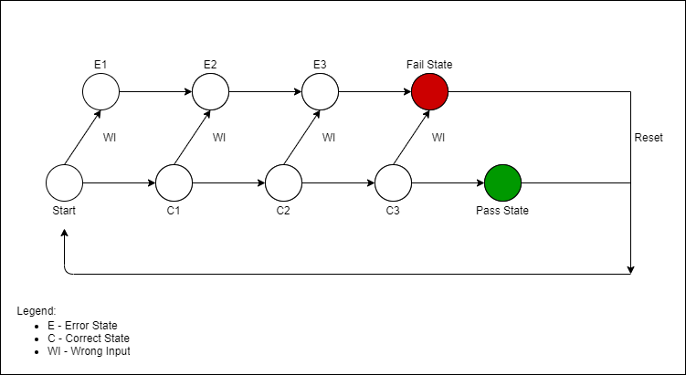

<h1 align="center" style="font-size:100px" >
  Digital Electronics Engineering
</h1>

An digital electronic locking system that is using the Digilent Nexys4 Atrix-7 FPGA trainer board to design, implement and deploy working software in VHDL.

The digital locking system is a state-based design with a user defined input. On the Atrix-7 board there are two LED indicators labeled LD17 and LD16. In addition, there are 5 push button imputs labeled BTNL, BTNU, BTND, BTNR and BTNC. The locking system uses a 4-input combination that the user will select and assign with the bottom 16 switches. The switches are grouped in 4-bit patterns with following code sequence:

  

The switches are then decoded to create a value from one of the sets of four switches and this will be used as the first value that will be compared to the button that the user is pressing. This is achieved by taking the group of four switches and whatever switch is high "1"  it will then correspond to a numbered value. For example, if the sequence is 0100 the value would be 3 because the third bit is high. 

State diagram below.

  

## Project Code
> [Project Code](DesignProject.vhd): Find my code here

## System Requirements
- **Software**: Vivado 2019.2
- **Language**: VHDL

## Credits
#### Speacial Thanks:
- Dr. Lei Zhang
  - Digital Electronics Professor
- Dave Duguid
  - Digital ElectronicsLab Professor
